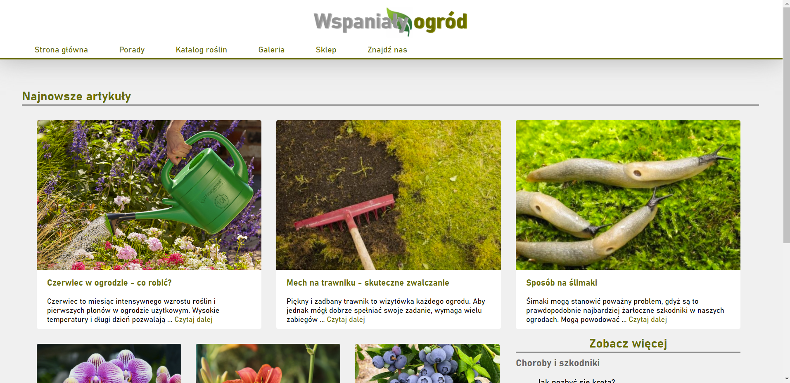

# Wspanialy ogrod 2
Project to pass the course "Web application programming". Application of PHP, Laravel, Apache server, MySQL, CRUD, MVC.

## General Information
- Acquisition of application design and programming skills
websites in PHP that work with the MySQL database.
- Getting to know the possibilities offered by the Laravel framework for the PHP language.

## Technologies Used
- HTML5
- CSS
- Vanilla JavaScript
- PHP 8.0.11
- Laravel Framework 8.79.0
- XAMPP v3.3.0
- Apache NetBeans IDE 12.3
- jQuery 3.6.0

## Features
- User can read articles and view plants. 
- User can create and log into an account.
- User can add, edit and delete comments.
- User can place orders in the store.

## Screenshots

## Usage
1. In XAMPP start "Apache" and "MySQL".
2. Open terminal and go to project folder.
3. Type "php artisan serve".
4. Open any browser and type [http://localhost:8000](http://localhost:8000).

## Acknowledgements
- This project was inspired by [Zielony ogrodek](https://zielonyogrodek.pl).
- This project was based on [Zintegrowany Program Rozwoju Politechniki Lubelskiej](https://weii.pollub.pl/projekty-weii/projekt-zintegrowany-program-rozwoju-politechniki-lubelskiej-czesc-druga).
